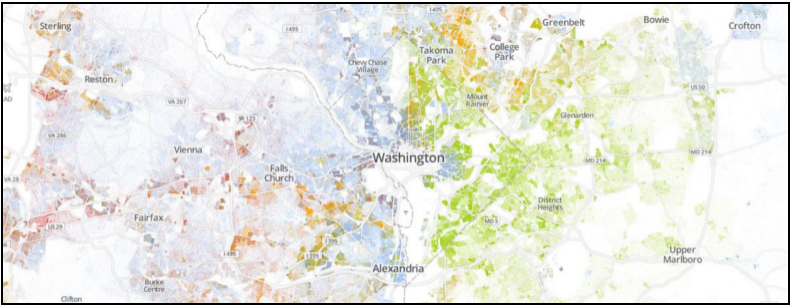
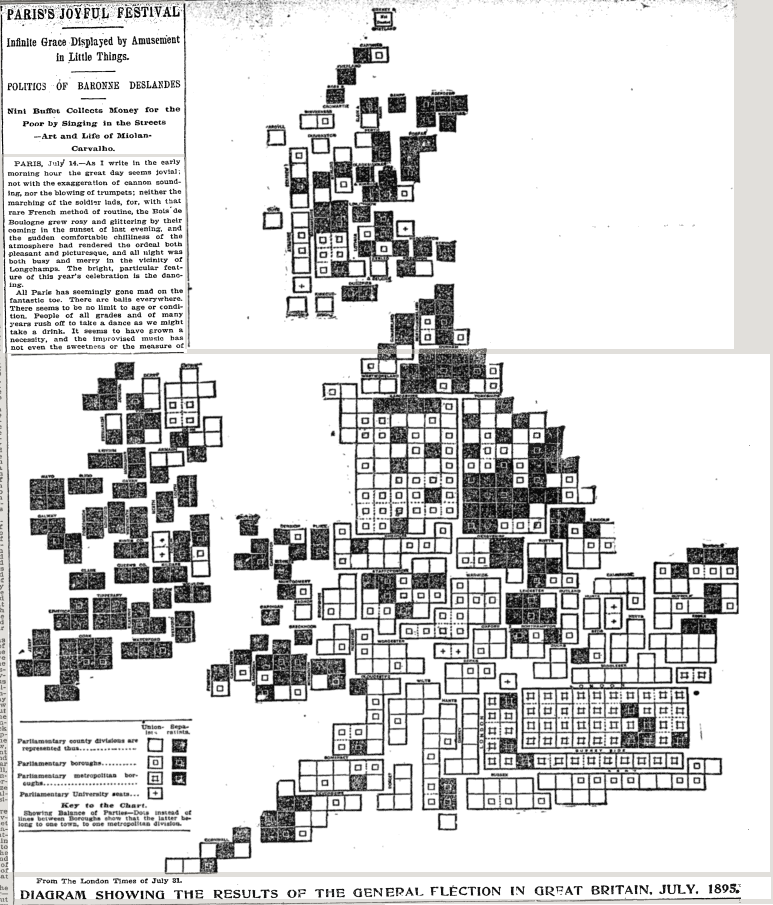
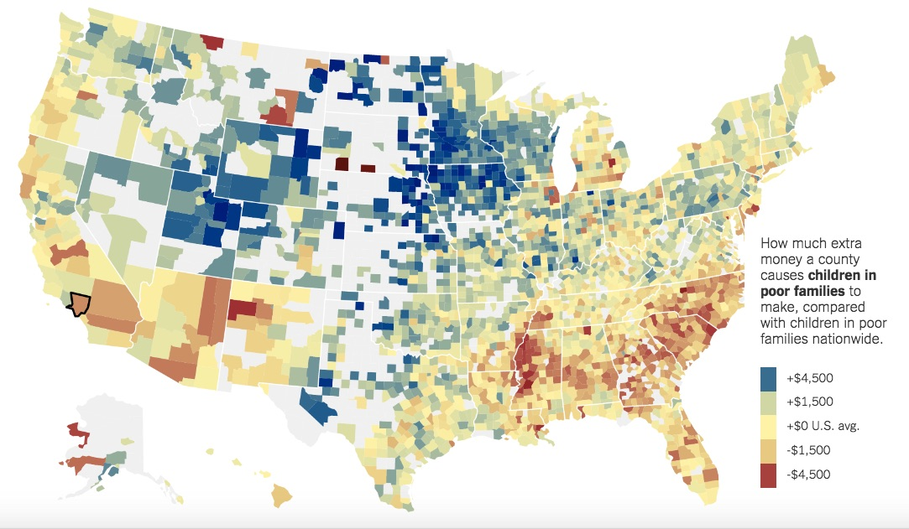
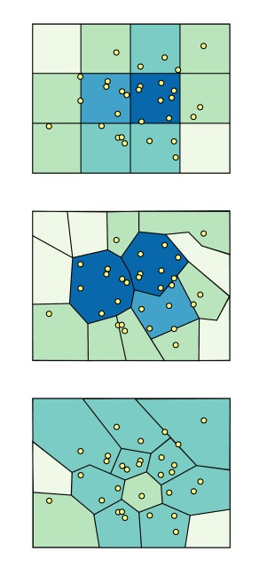
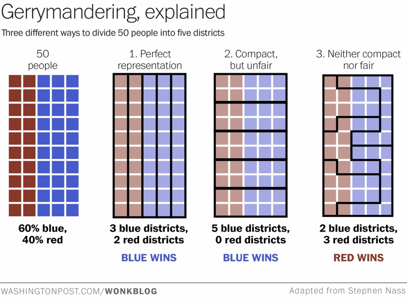
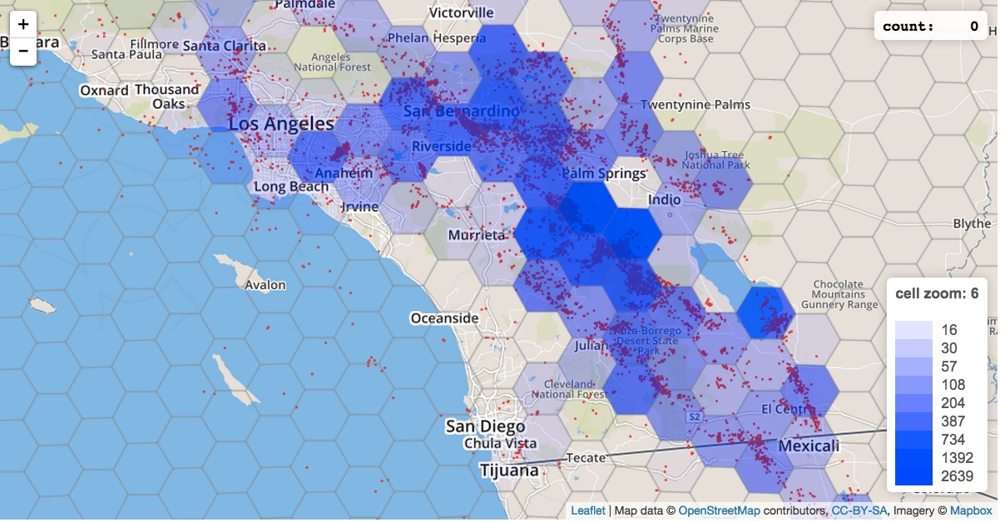

```{r setup, include=FALSE}
knitr::opts_chunk$set(echo = TRUE, message=FALSE, cache=TRUE, warning=FALSE)
```

## Types of geographic data
There are three main types of geographic data:

- points 
- lines
- polygons

People often also talk about images as geographic data, because so many maps come that way (tiles from googlemaps and OpenStreetMap, satellite imagery). So, we could also think about the difference between

- vector data (lines and polygons), and
- raster data (images)


## Tiles
Mapbox has a [nice explanation](https://www.mapbox.com/help/how-web-maps-work/) of how map tiles work. Let's check it out! 

## Leaflet
Leaflet is a JavaScript mapping library.

This means it plays nicer with things like d3, but we can use it in R as well, through an `htmlwidget`.

## Points

## Making a map with points in R with leaflet
We're going to be doing a lot of the stuff from the RStudio [leaflet tutorial](https://rstudio.github.io/leaflet/).

```{r}
library(leaflet)
```

```{r}
m <- leaflet() %>%
  setView(-93.2650, 44.9778, zoom = 4) %>%
  addProviderTiles("Stamen.Toner") %>%  # Add default OpenStreetMap map tiles
  addMarkers(lng=-93.2650, lat=44.9778, popup="Minneapolis!")
m
```

## We need more data!!

Lets look at [storm data](http://www.ncdc.noaa.gov/stormevents/ftp.jsp) from the NOAA. It comes in a few files that we need to join together in order to use. 

```{r}
library(readr)
library(dplyr)

library(RCurl)

stormlocs <- getURL("https://raw.githubusercontent.com/AmeliaMN/SummerDataViz/master/Geo/StormEvents_locations-ftp_v1.0_d2016_c20160810.csv")
stormlocs <- read_csv(stormlocs)
stormdetails <- getURL("https://raw.githubusercontent.com/AmeliaMN/SummerDataViz/master/Geo/StormEvents_details-ftp_v1.0_d2016_c20160810.csv")
stormdetails <- read_csv(stormdetails)


#stormlocs <- read_csv("StormEvents_locations-ftp_v1.0_d2016_c20160810.csv")
#stormdetails <- read_csv("StormEvents_details-ftp_v1.0_d2016_c20160810.csv")
stormlocs <- stormlocs %>%
  left_join(stormdetails, by="EVENT_ID")
lightning <- stormlocs %>%
  filter(EVENT_TYPE=="Lightning")
```

## Mapping the lightning
Now, we can programmatically map them. 
```{r}
m <- leaflet(data=lightning) %>%
  addMarkers(~LONGITUDE, ~LATITUDE)

# OpenStreetMap
m %>%
  addTiles()
  
# Stamen
m %>% 
  addProviderTiles("Stamen.Toner") 

```

## Find another storm type to map
Bonus-- add popups!

## One approach

```{r}
mtw <- stormlocs %>%
  filter(EVENT_TYPE=="Marine Thunderstorm Wind")

m <- leaflet(data=mtw) %>%
  addProviderTiles("Stamen.Toner") %>% 
  addMarkers(~LONGITUDE, ~LATITUDE, popup=~EVENT_NARRATIVE)

m
```

## Plotting lots of points

I love the [Racial Dot Map](http://www.coopercenter.org/demographics/Racial-Dot-Map). Let's go check it out!




## Lines

## I don't have much to say here
- Streets?
- ??

## Polygons

## Lets start with something easy(ish) -- circles

```{r}
tornados <- stormlocs %>%
  filter(EVENT_TYPE=="Tornado")
```

```{r}
m <- leaflet(data=tornados) %>%
  addTiles() %>%  # Add default OpenStreetMap map tiles
  addCircles(~LONGITUDE, ~LATITUDE, weight = 1, radius = ~DAMAGE_PROPERTY*100, popup = ~EVENT_NARRATIVE)
m
```

## But usually, you want boundaries
Most of the time, you need to aggregate your data in some way. Think about states, countries, zipcodes, counties, etc. Data often comes pre-aggregated at a particular spatial aggregation, or you can't show all the individual points. 

## Old-school choropleth map



## More modern choropleth

[The best and worst places to grow up: How your area compares ](http://www.nytimes.com/interactive/2015/05/03/upshot/the-best-and-worst-places-to-grow-up-how-your-area-compares.html?_r=0)



## Polgyons come in shapefiles
Most boundaries (state, national, etc) are provided in terms of polygons. Major mapping software ArcGIS, from ESRI, has essentially set the standard formats. 

Look in the [GitHub repo](https://github.com/AmeliaMN/SummerDataViz/tree/master/Geo/cb_2015_us_state_500k) to see some examples of how this looks. There are many files with different extensions: .prj (the projection), .shp (the shapefile), .cpg (??), .dbf (??), .shx (??). 

You need special software or packages to work with shapefiles. 

## State shapefiles
I got these from [the Census](https://www.census.gov/geo/maps-data/data/cbf/cbf_state.html). You can choose the resolution. 

If you want, the zipfile of the shapes I used is [here](https://github.com/AmeliaMN/SummerDataViz/blob/master/Geo/cb_2015_us_state_500k.zip). 

We're going to use the `rgdal` package to deal with shapefiles

```{r}
library(rgdal)

# In the Console, I need to do a different path

states <- readOGR("cb_2015_us_state_500k", layer = "cb_2015_us_state_500k", verbose = FALSE)
```

In RStudio, you can click on the `states` object to see what a Large SpatialPolygonsDataFrame looks like. `@data` and `@polygons`. 

## Boring, internal data from shapefile

```{r}
leaflet(data=states) %>%
  addTiles() %>%
  addPolygons(stroke = FALSE, fillOpacity = 0.5, smoothFactor = 0.5, color =~colorQuantile("YlOrRd", states$AWATER)(AWATER)
  )
```


## Something more interesting -- need to count up some data
```{r}
tornadocount <- tornados %>%
  group_by(STATE) %>%
  summarize(n=n())
```


## Colors are tricky!

[colorbrewer](http://colorbrewer2.org/#type=sequential&scheme=BuGn&n=3)

```{r}
colors <- c("#edf8fb", "#b2e2e2", "#66c2a4", "#238b45")
tornadocount <- tornadocount %>%
  mutate(color = cut(n, breaks=quantile(n)))

# Baaaaad factor practice. Do as I say, not as I do?!
levels(tornadocount$color) <- colors
```


## Joining data
```{r}
states@data$NAME <- toupper(states@data$NAME)
states@data <- left_join(states@data, tornadocount, by=c("NAME"="STATE"))
```


## Putting it all together
```{r}
leaflet(data=states) %>%
  addTiles() %>%
  addPolygons(stroke = FALSE, fillOpacity = 0.5, smoothFactor = 0.5, color = ~states@data$color.y)
```

## Some issues with polygon maps

## Modifiable areal unit problem



[An introduction to the Modifiable Areal Unit Problem](http://gispopsci.org/maup/)

## Gerrymandering



[The best explanation of gerrymandering you will ever see](https://www.washingtonpost.com/news/wonk/wp/2015/03/01/this-is-the-best-explanation-of-gerrymandering-you-will-ever-see/)

## Spatial aggregation 

My colleague Aran Lunzer and I [made a demo](http://tinlizzie.org/~aran/spatialAggregation.html) of how spatial aggregation can impact the visual pattern you see. Let's go check it out! 



