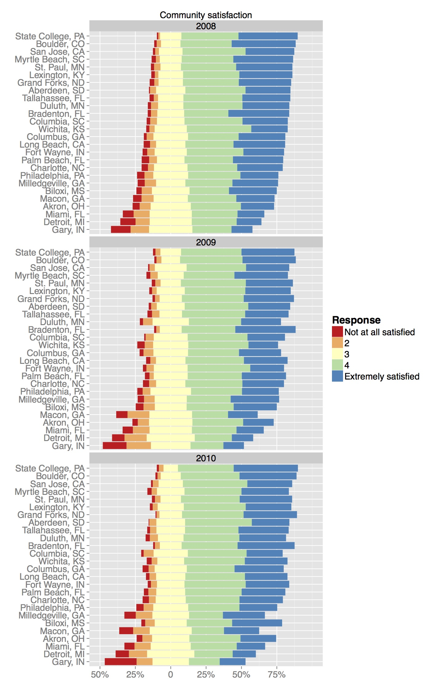

## R graphics
There are many ways to make graphics in R.

- base R
- lattice graphics
- ggplot2 

## ggplot2
ggplot2 is an R package by Hadley Wickham that lets you make beautiful R graphics (relatively) easily. 

It's part of the tidyverse, which I recommend everyone get to know (dplyr, stringr, lubridate, broom... and many more).

The name ggplot2 refers to a famous book on data visualization theory called The Grammar of Graphics.

```{r, echo=FALSE, message=FALSE, warning=FALSE}
require(knitr)
opts_chunk$set(cache=TRUE, warning=FALSE, message=FALSE, fig.align='center')
```

## Getting started
First, we need to install and load the package,
```{r}
#install.packages("ggplot2")
library(ggplot2)
```

## Diamonds data
To start, I'm going to use the diamonds data that comes with ggplot2,
```{r}
str(diamonds)
```


## qplot()-- the easy way out
```{r, plot.height=2}
qplot(carat, data=diamonds)
```

## ggplot2 syntax
```{r, eval=FALSE}
qplot(x=carat, data=diamonds)
```
`qplot()` performs similar functionality to the base R graphics function `plot()`-- it makes a best guess at what kind of plot you want, given the data you provide. 

As a function qplot basically works like this: **qplot([x_variable], [y_variable], data = [data_frame], geom = "[geom_type]")** (Remember, use ```?qplot()``` or ```help(qplot)``` if you need help.) The function makes assumptions on the best type of chart to use. In the above example, because you only passed one variable it assumed a histogram is what is needed. We could explictly tell it to do that. 

If you've used `plot()` before, this might seem a little different, because we're not using the $ operator. 

Instead, you're listing the name of the variable(s) and then telling R where to "look" for that variable with `data=`. 

## More qplot()

```{r}
qplot(x=clarity, fill=cut, data=diamonds)
```

## ggplot()

But, in order to really harness the power of ggplot2 you need to use the more general ggplot() command. The idea of the package is you can "layer" pieces on top of a plot to build it up over time.

You always need to use a ggplot() call to initialize the plot. I usually put my dataset in here, and at least some of my "aesthetics." But, one of the things that can make ggplot2 tough to understand is that there are no hard and fast rules. 
```{r}
p1 <- ggplot(aes(x=clarity, fill=cut), data=diamonds)
```
If you try to show p1 at this point, you will get "Error: No layers in plot." This is because we haven't given it any geometric objects yet. 


## geoms
In order to get a plot to work, you need to use "geoms" (geometric objects) to specify the way you want your variables mapped to graphical parameters.

```{r, message=FALSE, fig.height=3}
p1 + geom_bar()
```

## geoms have options

```{r}
p1 + geom_bar(position="dodge")
```

## Lots of options
```{r}
p1 + geom_bar(position="fill")
```


## Two variables
```{r}
p2 <- ggplot(aes(x=carat, y=depth), data=diamonds)
p2 + geom_point()
```

## Same data, different geom
```{r}
p2 + geom_bin2d()
```

## Saving your work (or not)
Notice that I'm not saving these geom layers-- I'm just running 

p2 + [something] 

to see what happens. But, I can save the new version to start building up my plot,
```{r}
p2 <- p2 + geom_bin2d()
```

## Better labels
```{r}
p2 <- p2 + xlab("Carat") + ylab("Depth") + 
 guides(fill=guide_legend(title="Number of diamonds"))
p2
```

## Different breaks
```{r}
p2 + scale_fill_continuous(breaks=c(1500, 2500, 3500,4500))
```

## Log scale
```{r}
p2 + scale_fill_continuous(trans="log")
```

## Log scale, different breaks
```{r}
p2 + scale_fill_continuous(trans="log", breaks=c(1,10,100,1000,5000))
```

## Faceting (wrapping)
```{r}
p2 + facet_wrap(~color)
```

## Faceting (grid)
```{r}
p2 + facet_grid(color~clarity)
```

## Working with dates
```{r}
# install.packages("lubridate")
# install.packages("dplyr")
library(lubridate)
library(dplyr)
```

## Data with dates
The economics dataset also comes with ggplot2, and is time series data. The observations are months, and the variables are economic indicators like the number of unemployed people. Because this is data from a package, you can read about it by using the `?`.

```{r, eval=FALSE}
?economics
```

```{r}
econ <- economics
str(econ)
econ <- econ %>%
  mutate(date = ymd(date)) 
old <- econ %>%
  filter(year(date)<"1970")
old <- old %>%
  mutate(date = ymd(date))
```

##
```{r}
p3 <- ggplot(data=old) + geom_line(aes(x=date, y=pce))
p3
```

## For nicer date formatting
```{r}
# install.packages("scales") 
library(scales)
```

##
```{r}
p3 + 
  scale_x_date(breaks = date_breaks("3 months"), 
                   labels = date_format("%b %Y"))
```

##
```{r}
p3 + 
  scale_x_date(breaks = date_breaks("6 months"), 
                   labels = date_format("%B %y"))
```


## Many layers
```{r, eval=FALSE}
baseplot <- ggplot() + 
  aes(x=citystate, y=Freq, fill = Response, order=Response) +
  facet_wrap(~year, nrow=3)+geom_bar(data = trial2$neg, stat = "identity") + 
  scale_fill_manual(breaks=c("Not at all satisfied", "2", "3", "4", 
                             "Extremely satisfied"), values=colorsB, 
                    name="Response") + 
  geom_bar(data = trial2$pos, stat = "identity") + coord_flip() + 
  ggtitle("Community satisfaction") + xlab("") +ylab("") + 
  scale_y_continuous(limits=c(-0.5, 1), 
                     breaks=seq(from=-0.5, to=0.75, by=0.25), 
                     labels=c("50%", "25%", "0", "25%", "50%", "75%")) + 
  theme(legend.text=element_text(size=14), 
        legend.title=element_text(size=16), 
        axis.text=element_text(size=14), 
        strip.text=element_text(size=14))
baseplot 
```

## {.flexbox .vcenter}


## Colors

```{r}
# install.packages("RColorBrewer")
library(RColorBrewer)
display.brewer.all(n=5, type="qual")
```

## 
```{r}
p1 + geom_bar(position="dodge") + scale_fill_brewer(palette="Dark2")
```

## Saving your work 

```{r}
p1 <- p1 + geom_bar(position="dodge") + scale_fill_brewer(palette="Dark2")
ggsave(p1, filename="mycoolplot.jpg")
```

## ATUS data

Now, I want you to try some of your new skills on the American Time Use Survey data. 

I've given you this data in the Data folder. You can load it in the point-and-click way, or do it programmatically. 

```{r}
atus <- read.csv("../Data/atus.csv")
```

## Challenge questions

- Make a stacked bar chart of `atus` data, but change the color scheme.

- Make a scatterplot of `atus` data, but remove the grey-and-white background.

- Make a plot that helps you determine which state has the most veterans. 

- Are most veterans married or not?


## Quick charts with ggplot
We see from our stats function that the **median (298,512)** is significantly lower than the **mean (401,605.7)**. We know that might be a sign of some outliers on he higher end, particularly if we read **Sarah's Cohen's Numbers in the Newsroom** [http://store.ire.org/products/numbers-in-the-newsroom-using-math-and-statistics-in-news-second-edition-e-version]. Let's chart our data to see the distribution.

The `ggplot` library has many charting capabilities, but `qplot()` function is the quickest way to quickly visualize your data. Let's make a histogram of *COST_SUM*.

```{r}
qplot(COST_SUM, data = docs)
```


```{r}
qplot(COST_SUM, data = docs, geom = "histogram")
```

The histogram is revealing, a similar type of chart is **density** which also shows the distribution.
```{r}
qplot(CLAIM_COUNT, data = docs, geom = "density")
```

So far we've only charted one variable. Maybe we want to look at two variables in comparison. For example, How the total claims per physician (**CLAIM_COUNT**) compares to the number of of brand name claims (**BRAND_COUNT**). 

```{r}
qplot(CLAIM_COUNT, BRAND_COUNT, data = docs)
```

Maybe, you want to look at that as line graph, instead.

```{r}
qplot(CLAIM_COUNT, BRAND_COUNT, data = docs, geom = "line")
```

That, isn't super helpful. What we really want to see is a general **smooth** line showing the general trend. 

```{r}
qplot(CLAIM_COUNT, BRAND_COUNT, data = docs, geom = "smooth")
```

Sadly, that isn't that interesting. The trend shows us the trend AND the individual plotted points to see who is above or below the general trend line. You can use the **combine function** ```c()``` to chart both.
```{r}
qplot(CLAIM_COUNT, BRAND_COUNT, data = docs, geom = c("point", "smooth"))
```


## Resources for ggplot2

* [ggplot2 cheatsheet](http://www.rstudio.com/wp-content/uploads/2015/03/ggplot2-cheatsheet.pdf)
* [R graphics cookbook](http://www.cookbook-r.com/Graphs/)
