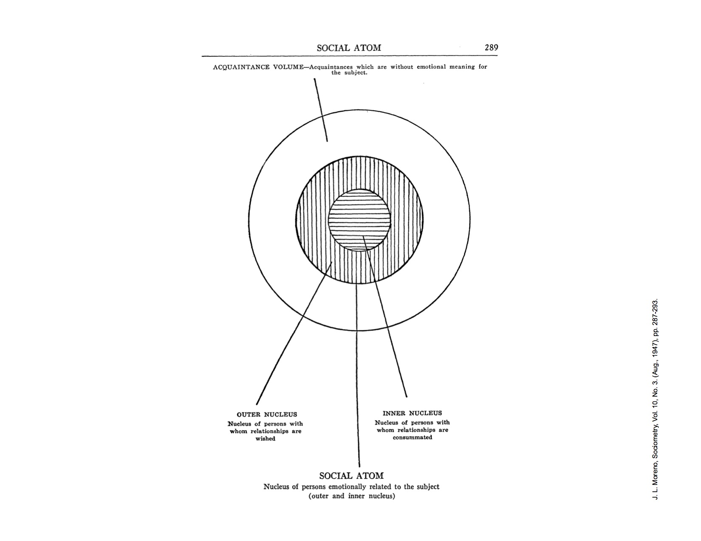
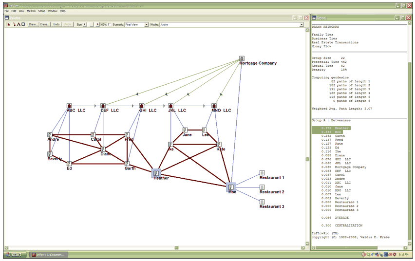
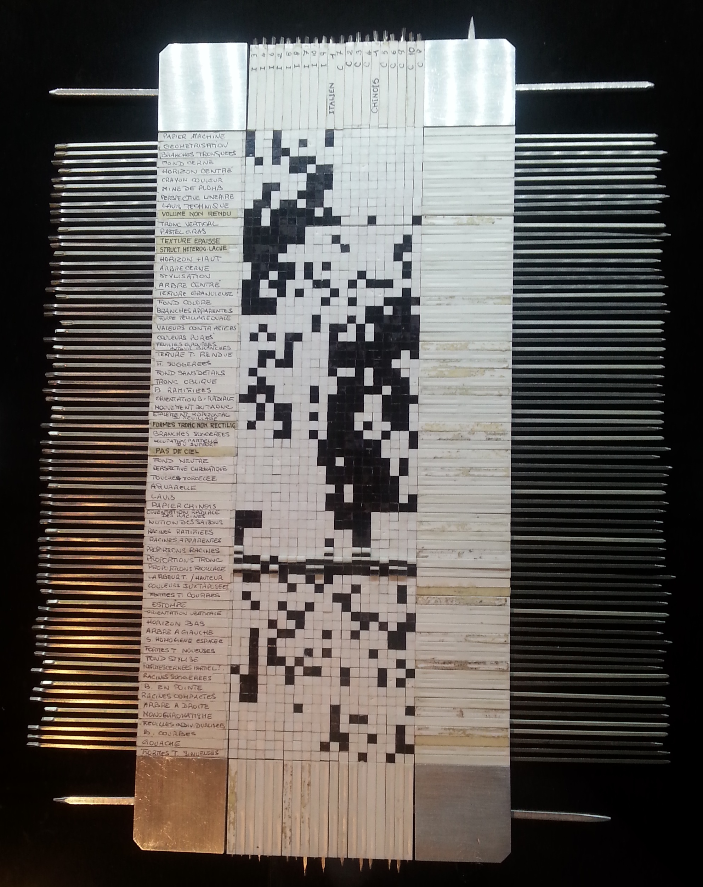
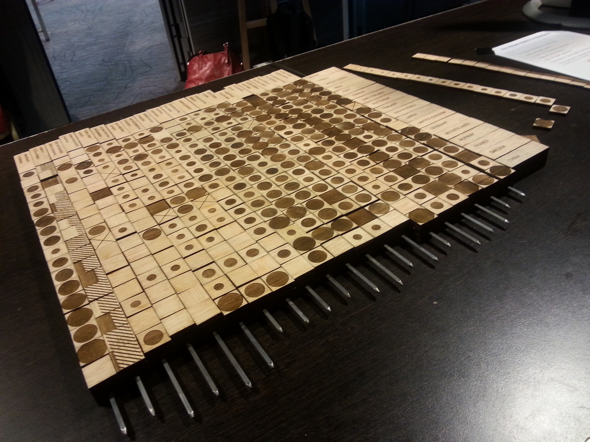

```{r setup, include=FALSE}
knitr::opts_chunk$set(echo = TRUE, message=FALSE, cache=TRUE)
```

## Networks

In the 1930s, Jacob Moreno was thinking about the "social atom" and making "sociograms" (network diagrams). 



(Image via [Mark Hansen](http://www.stat.ucla.edu/~cocteau/))

## More examples?

[Identifying slumlords with SNA](http://www.orgnet.com/slumlords.html)



## Game of Thrones data

I am a little out of the cultural loop, so I don't have a lot of contextual knowledge, but the [hottest network analysis lately](http://www.macalester.edu/~abeverid/thrones.html) is about Game of Thrones, so...

```{r}
library(readr)
storm <- read_csv("5-Networks/stormofswords.csv")
head(storm)
```

## Working with networks

R packages:

- igraph
- network
- GGally (for visualization)
- ggraph (for visualization)

Other ways:

- Gephi
- d3

## Lets try igraph first

```{r}
library(igraph)
library(GGally)
g <- graph.data.frame(storm)
plot(g)
```

Defaults are pretty ugly. 

## Making igraph a bit more readable

```{r}
plot(g, edge.arrow.size=0, vertex.size=7, vertex.label.cex=0.7)
```

## Changing the layout-- circle

```{r}
plot(g, edge.arrow.size=0, vertex.size=7, vertex.label.cex=0.7, layout=layout_in_circle)
```

## Changing the layout -- sphere
```{r}
plot(g, edge.arrow.size=0, vertex.size=7, vertex.label.cex=0.7, layout=layout_on_sphere)
```

## But really, we want the "random" network to be less collapsed

```{r}
l <- layout_with_fr(g,niter=500)
plot(g, edge.arrow.size=0, vertex.size=7, vertex.label.cex=0.7, layout=l)
```

It can be good to save your layout separately so you don't get a subtle variation every time you plot. 

## Curved edges
```{r}
E(g)$width <- E(g)$Weight/6
plot(g, edge.arrow.size=0, vertex.label.cex=0.7, vertex.color="grey", layout=l, edge.curved=TRUE, vertex.label.color="black")
```

## What about GGally? 

Lots of dependencies necessary. 

```{r}
library(GGally)
library(network)
library(sna)
library(intergraph)
ggnet2(g, label=TRUE)
```

But, defaults are prettier. 

## Weighted edges

```{r}
ggnet2(g, label=TRUE, edge.size = "Weight", edge.alpha=0.5)
```

AAAAA

## Okay, lets do some rescaling

```{r}
library(dplyr)
storm <- storm %>%
  mutate(ScaledWeight = Weight / max(Weight))
g <- graph.data.frame(storm)
ggnet2(g, label=TRUE, edge.size = "ScaledWeight", node.size = 4, mode = "fruchtermanreingold", layout.par = list(cell.jitter = 0.75, repulse.rad=0.7), label.size = 3, edge.color="black", edge.alpha=0.7)
```


Now I think we've gone too far! You will have to figure out what makes sense. 

## ggraph

```{r}
# We're going off the rails a bit here
# library(devtools)
# install_github('hadley/ggplot2')
# install_github('thomasp85/ggforce')
# install_github("thomasp85/ggraph")
library(ggraph)
ggraph(g, 'igraph',algorithm = 'kk') +
  geom_edge_fan(aes(alpha = ..index..)) + 
  geom_node_point() +
  ggforce::theme_no_axes()
```

## Networks in d3 -- the lazy way!

```{r}
library(networkD3)
gd <- get.data.frame(g)
simpleNetwork(storm)
```

## There is more to networks than just node-edge diagrams
Lots of "centralities"


## Eigenvector Centrality

```{r}
library(ggplot2)
ec <- eigen_centrality(g)$vector
ec <- data.frame(ec)
ec$names <- rownames(ec)
ec %>%
  arrange(desc(ec)) %>%
  slice(1:10) %>%
  ggplot() + geom_bar(aes(x=reorder(names, ec), y=ec), stat="identity")
```

Looks like what Andrew Beveridge and Jie Shan got!


## Sizing nodes
```{r}
V(g)$size <- ec$ec*10
plot(g, edge.arrow.size=0, vertex.label.cex=0.7, vertex.color="grey", layout=l, edge.curved=TRUE, vertex.label.color="black")
```

## Betweenness centrality 

```{r}
bc <- betweenness.estimate(g, cutoff=10)
bc <- data.frame(bc)
bc$names <- rownames(bc)
bc %>% 
  arrange(desc(bc)) %>%
  slice(1:10)
```

Not quite what they got in the paper. Hmm. 

## Page rank

```{r}
pageRank <- page_rank(g)$vector
pageRank <- page_rank(g, damping = 0.15)$vector
head(as.matrix(sort(pageRank,decreasing = TRUE)))
```
Again, not the same as the paper. 


## Adjacency matrix

```{r}
p <- ggplot(storm, aes(x=Source, y=Target, fill=Weight)) +
  geom_raster() +
  theme_bw() +
  scale_x_discrete(drop = FALSE) +
  scale_y_discrete(drop = FALSE) +
  theme(
    # Rotate the x-axis lables so they are legible
    axis.text.x = element_text(angle = 270, hjust = 0),
    # Force the plot into a square aspect ratio
    aspect.ratio = 1,
    # Hide the legend (optional)
    legend.position = "none")
p
```

Whoa!

## Reordering
```{r}
# library(devtools)
# install_github("hadley/forcats")
library(forcats)
```

```{r}
storm_ordered <- storm %>%
  left_join(ec, by = c("Source" = "names")) %>%
  left_join(ec, by = c("Target" = "names"))


p %+% storm_ordered
```

## Change ordering to by betweenness centrality?

```{r}
storm_ordered2 <- storm %>%
  left_join(bc, by = c("Source" = "names")) %>%
  left_join(bc, by = c("Target" = "names"))

storm_ordered2 <- storm_ordered2 %>%
  mutate(Source = fct_reorder(Source, bc.x),
         Target = fct_reorder(Target, bc.y))

# swap the data in the plot
p %+% storm_ordered2
```

## Light aside -- Bertin matrices



## Another one




## In R
```{r}
# install.packages("bertin",repos="http://r-forge.r-project.org")
library(bertin)
data(Hotel)
image.bertin(bertinrank(Hotel, ties.method="first"), main= "Hotel data")
plot.bertin(bertinrank(Hotel, ties.method = "first"), main= "Hotel data")
plot.bertin(Hotel, palette=c("white","black"))
```

## On our data, doesn't work well because it is so big!

```{r, eval=FALSE}
mini_storm <- storm_ordered %>%
  filter(Source %in% ec$names[1:10],
         Target %in% ec$names[1:10]) %>%
  mutate(Source = droplevels(Source),
         Target = droplevels(Target)) %>%
  select(Source, Target, Weight)
g2 <- graph.data.frame(mini_storm)
mat <- get.adjacency(g2)
plot.bertin(bertinrank(mat, ties.method="first"))
```

Hmm...